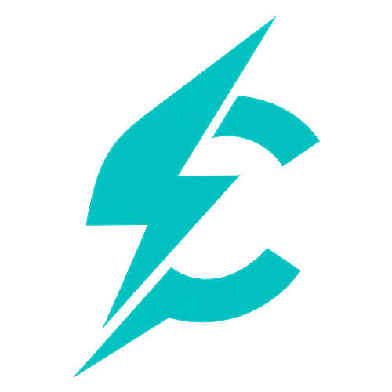

**Bytecharge** is a modern programming language designed for high-performance software development, offering simplicity, efficiency, and portability. It is the official product of **MeanByte**.

---

## 🚀 **Key Features**

* **Cross-platform**: Compatible with Windows, Linux, and macOS.
* **High performance**: Compiled language optimized for speed and low resource usage.
* **Modern syntax**: Clean, simple, and easy-to-learn syntax designed for developers of all levels.
* **Robust standard library**: Comes with a wide range of built-in functionalities for rapid development.

---

## 🛠️ **Installation**

The recommended way to install **Bytecharge** is using the official **Byteloader** tool.

### **Prerequisites:**
Before installing Byteloader, you need to install the dependencies. The security mechanism involved in encrypting the compilation of Bytecharge code is done using Python and pycryptodome, so you'll need this to use Bytecharge (including Byteloader). In Linux, you can install dependencies using a command:

| Distribution       | Command                                                  |
| ------------------ | -------------------------------------------------------- |
| Ubuntu/Debian      | `sudo apt install python3`                               |
| Fedora/RHEL/CentOS | `sudo dnf install python3` ou `sudo yum install python3` |
| Arch/Manjaro       | `sudo pacman -S python`                                  |
| openSUSE           | `sudo zypper install python3`                            |
| Gentoo             | `sudo emerge dev-lang/python`                            |
| Alpine             | `sudo apk add python3`                                   |
| Slackware          | `slackpkg install python3`                               |

- After downloading Python, you should download the pycryptodome library. You can do this using pip:
```sh
pip3 install pycryptodome
```

On Windows, you can download Python from the [official website](https://www.python.org/downloads/windows/), and use the same command in pip to install pycryptodome.


### ✅ **Step by step to install:**

1. Download **Byteloader** from the [Releases](https://github.com/MeanByte-io/Bytecharge/releases) section or the [official website](https://bytecharger.42web.io).
2. Run **Byteloader**; it will automatically detect your operating system and download the appropriate **Bytecharge** binary.
- To run Byteloader on Linux, navigate to the directory where it was downloaded from the terminal, and run it from the terminal using sudo, for example: `sudo ./Byteloader`. Don't forget to give permission to the file to run it as an executable!
4. For Linux users, **Byteloader** also configures the language globally, making the `bytecharge` command accessible system-wide.

### Common errors
On some Linux distributions, Python may conflict, interfering with the execution of Bytecharge, since it depends not only on a C compiler, but also on Python. The easiest way to solve this is to create a virtual environment for Bytecharge and install the dependencies. By default, when using Byteloader, Bytecharge is installed in the root directory and is accessible throughout the system via the terminal. So, just use the following commands to resolve this conflict (if it occurs):
```sh
python3 -m venv bytecharge
source bytecharge/bin/activate
pip3 install pycryptodome
```
That's it! Now, every time you want to run Bytecharge, just use the command `source bytecharge/bin/activate` to enter the virtual environment, and use the “Bytecharge” command normally.

---

## 📖 **Documentation**

The full documentation, including tutorials, language specifications, and advanced usage examples, is available in the **[Wiki](https://github.com/MeanByte-io/Bytecharge/wiki)** section of this repository.

---

## 📄 **License**

**Bytecharge** is **proprietary software** under the copyright of **MeanByte**.

### ✅ **You are allowed to:**

* Use **Bytecharge** freely for personal, educational, and commercial projects.
* Distribute compiled programs created with **Bytecharge** without paying royalties.

### ❌ **You are not allowed to:**

* Modify, reverse-engineer, or distribute the **Bytecharge** source code.
* Share or redistribute the internal components of **Bytecharge**.

By using **Bytecharge**, you agree to the terms and conditions set forth by **MeanByte**.

#### [Click here to read MeanByte's terms and conditions](https://github.com/MeanByte-io/Bytecharge/blob/main/terms_and_conditions.md)

> As mentioned in the license, Bytecharge is not open-source, but Byteloader is an external tool and is open-source, accepting contributions!

---

## 🔗 **Official Links**

* 🌐 [Website](https://bytecharger.42web.io)
* 📦 [Releases](https://github.com/MeanByte-io/Bytecharge/releases)
* 📚 [Documentation Wiki](https://github.com/MeanByte-io/Bytecharge/wiki)

---

## 🏢 **About MeanByte**

**MeanByte** is committed to delivering innovative and efficient software solutions. Bytecharge represents our vision for a powerful yet accessible programming language.
